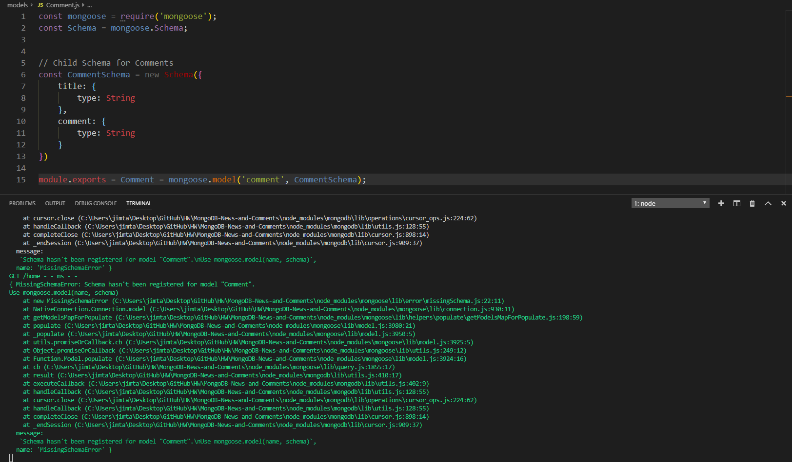
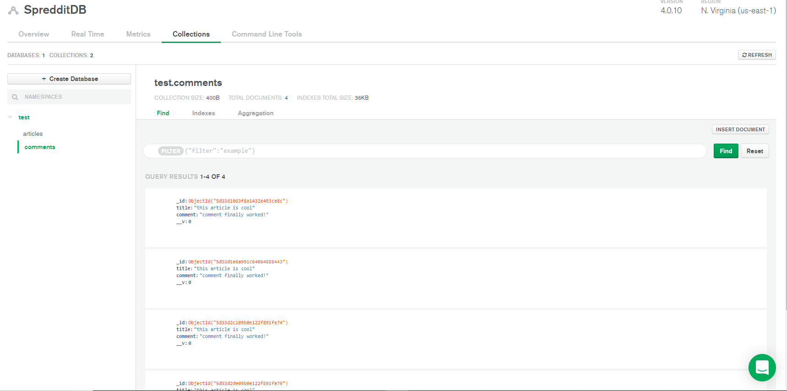
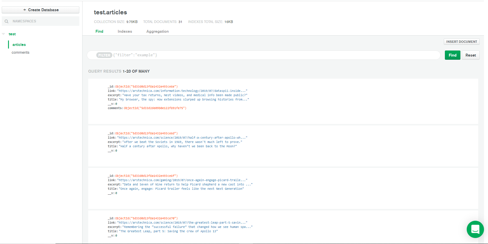

# Project Name: MongoDB-News-and-Comments

##Spreddit - Spreading the News, Today
Intended to provide current news now. Users are able to comment on articles and view popular articles easily and quickly. 

## Technology: 
* [NodeJS](https://nodejs.org/en/) - Javascript Runtime Engine
* [ExpressJS](https://expressjs.com/) - Web Framework
* [Handlebars](https://www.npmjs.com/package/express-handlebars) - View Engine for ExpressJS
* [Axios](https://www.npmjs.com/package/axios) - HTTP Client for NodeJS
* [Morgan](https://www.npmjs.com/package/morgan) - A Middleware request logger for an NodeJS
* [Cheerio](https://www.npmjs.com/package/cheerio) - A web scraper package for NodeJS

## New Technologies Used: 
* [MongoDB(via atlas)](https://www.mongodb.com/cloud/atlas) - NoSQL Database on a cloud atlas platform
* [Mongoose-NPM](https://www.npmjs.com/package/mongoose) - A NodeJS Package ORM for MongoDB

## Unfortunate Issues Currently, Being Worked on...

## Schema Error for the Database

## The Issue - Database is recognizing the Schema
### as seen below, the database is populated with both model schemas...

  

## Homepage Working and Scraping
 

## Author
* **Jim Tatarakis** - *Initial Work* - [JimTatarakis](https://github.com/JimTatarakis)